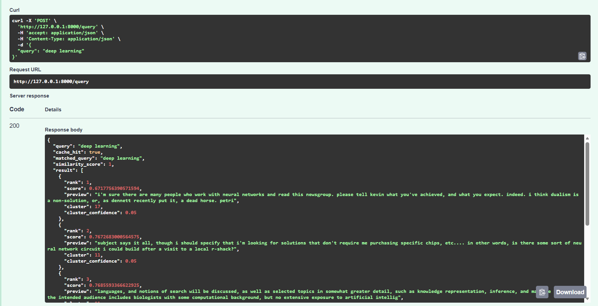

# Semantic Search System with Fuzzy Clustering & Semantic Cache

AI/ML Engineer Task Submission

---


---

# Project Overview

This project implements a **lightweight semantic search system** over the **20 Newsgroups dataset (~20,000 documents)**.

The system combines:

* vector embeddings
* fuzzy clustering
* semantic caching
* FastAPI service

to demonstrate a **real-world ML system architecture for semantic retrieval**.

Instead of relying on keyword matching, the system retrieves documents based on **semantic similarity in embedding space**.

---

# System Architecture

The search pipeline works as follows:

```
User Query
   ↓
Query Embedding
   ↓
Semantic Cache Lookup
   ↓ (cache miss)
Vector Search (FAISS)
   ↓
Cluster Analysis
   ↓
Top Results Returned
```

This architecture enables:

* fast repeated query responses
* semantic understanding of natural language queries
* scalable vector retrieval

---

# Dataset

Dataset used:

**20 Newsgroups Dataset**

~20,000 newsgroup posts across 20 categories.

Source:

https://archive.ics.uci.edu/dataset/113/twenty+newsgroups

Example topics include:

* computer hardware
* politics
* religion
* sports
* science
* firearms

The dataset contains **real-world noisy text**, making it ideal for testing semantic retrieval systems.

---

# Methodology

## Corpus Preparation

Raw posts contain formatting artifacts such as:

* headers
* email signatures
* quoted text

Preprocessing includes:

* text normalization
* whitespace cleanup
* document chunking

### Document Chunking

Long documents are divided into **~120 word chunks**.

This improves retrieval performance because embeddings capture **localized semantic context**.

```
Raw Document
   ↓
Text Cleaning
   ↓
Chunking (~120 words)
   ↓
Embedding Generation
```

---

# Embedding Model

Documents are embedded using:

**BAAI/bge-base-en-v1.5**

Reasons for selecting this model:

* strong performance on semantic retrieval tasks
* efficient inference speed
* good balance between embedding quality and compute cost

Each chunk is mapped to a **768-dimensional embedding vector**.

```
f : text → ℝ⁷⁶⁸
```

These vectors encode semantic relationships between documents.

---

# Vector Database

Embeddings are indexed using **FAISS (Facebook AI Similarity Search)**.

FAISS enables efficient **Approximate Nearest Neighbor (ANN)** search.

Given a query embedding **q**, the system retrieves the top-k nearest vectors:

```
NN_k(q) = argmax similarity(q, d_i)
```

Similarity is computed using **cosine similarity**.

This allows fast search across tens of thousands of vectors.

---

# Fuzzy Clustering

Traditional clustering assigns each document to **one cluster only**.

However, real-world topics overlap.

Example:

A document about **gun legislation** belongs to both:

* politics
* firearms

To capture this behaviour, the system uses **Fuzzy C-Means clustering**.

---

## Membership Matrix

The clustering algorithm produces a **membership matrix**:

```
U ∈ ℝ^(C × N)
```

Where:

C = number of clusters
N = number of documents

Each value:

```
U_ij
```

represents the **probability that document j belongs to cluster i**.

Each column satisfies:

```
Σ U_ij = 1
```

Example:

| Document | Cluster 3 | Cluster 7 | Cluster 12 |
| -------- | --------- | --------- | ---------- |
| Doc 102  | 0.61      | 0.29      | 0.10       |

This means the document primarily belongs to **Cluster 3**, but also shares similarity with other clusters.

This soft assignment better reflects **topic overlap in natural language data**.

---

# Cluster Interpretation

Manual inspection of clusters reveals meaningful groupings.

| Cluster | Topic                |
| ------- | -------------------- |
| 3       | Sports discussions   |
| 6       | Religion debates     |
| 10      | Politics and policy  |
| 11      | Computer hardware    |
| 13      | Firearms discussions |

Documents near cluster boundaries often have **similar probabilities across clusters**, indicating semantic ambiguity.

---

# Semantic Cache

Traditional caching only works for **exact string matches**.

Example:

```
"What is machine learning?"
"What is ML?"
```

These queries are semantically identical but lexically different.

To solve this, the system implements a **semantic cache**.

Workflow:

```
Query embedding
↓
Compare with cached query embeddings
↓
Cosine similarity
↓
Reuse cached result if similarity exceeds threshold
```

---

# Cache Threshold

The system uses:

```
SIMILARITY_THRESHOLD = 0.85
```

Empirical observations:

| Threshold | Behaviour                   |
| --------- | --------------------------- |
| 0.70      | excessive cache hits        |
| 0.85      | balanced accuracy and reuse |
| 0.95      | minimal cache reuse         |

0.85 provides the best trade-off between **accuracy and computational savings**.

---

# API Service

The system exposes a REST API using **FastAPI**.

---

## POST /query

Example request:

```
{
 "query": "space shuttle launch"
}
```

Example response:

```
{
 "query": "...",
 "cache_hit": false,
 "result": [...],
 "dominant_cluster": 11,
 "latency_ms": 12.3
}
```

---

## GET /cache/stats

Returns cache statistics:

```
{
 "total_entries": 5,
 "hit_count": 3,
 "miss_count": 2,
 "hit_rate": 0.6
}
```

---

## DELETE /cache

Clears the semantic cache.

---

# Demo

### FastAPI Documentation


### Query Request


### Query Response



### Cache Statistics


# Evaluation

Example test queries:

| Query                     | Retrieved Topics                     |
| ------------------------- | ------------------------------------ |
| space shuttle launch      | NASA missions and astronaut training |
| machine learning          | neural networks and AI research      |
| graphics card performance | computer hardware discussions        |
| gun policy debate         | firearms legislation discussions     |

The system retrieves **semantically related documents even when keywords differ**.

---

# Project Structure

```
semantic_search_system

embedder.py
vector_store.py
clustering.py
cluster_analysis.py
semantic_cache.py
main.py
requirements.txt

data
 embeddings.npy
 vector.index
 documents.pkl
 clusters.pkl
```

---

# Running the Project

Create environment

```
python -m venv venv
```

Activate environment

```
venv\Scripts\activate
```

Install dependencies

```
pip install -r requirements.txt
```

Run API

```
uvicorn main:app --reload
```

Open documentation

```
http://127.0.0.1:8000/docs
```

---

# Conclusion

This project demonstrates how modern machine learning techniques can be combined to build a **semantic search system**.

Key components include:

* transformer embeddings
* vector similarity search
* fuzzy clustering
* semantic caching
* API-based query interface

The architecture reflects **real-world ML system design used in modern search and recommendation systems**.

---

# Author

**Arpita Kumar**

AI/ML Engineer Task Submission

GitHub Repository:

```
https://github.com/arpitakumar2003-spec/semantic-search-system
```

---

# Future Improvements

Potential improvements include:

* distributed vector search
* GPU acceleration
* hybrid search (keyword + semantic)
* Redis-based semantic caching
* retrieval evaluation metrics
